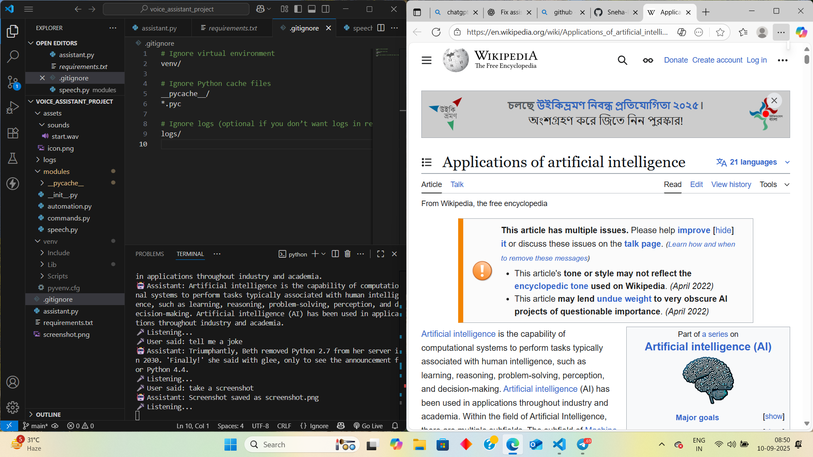

```markdown
# 🎙️ Voice Assistant Project  

A simple yet powerful **Python-based Voice Assistant** that listens to your commands, responds with speech, and automates daily tasks like opening apps, playing YouTube, telling jokes, giving time, and more.  

---

## 📂 Project Structure  

```

voice\_assistant\_project/
│
├── assets/
│   ├── sounds/
│   │   └── start.wav           # Startup sound
│   └── icon.png                # Project/app icon
│
├── logs/
│   └── assistant.log           # Logs for assistant events & errors
│
├── modules/
│   ├── **init**.py             # Makes 'modules' a package
│   ├── automation.py           # Automates desktop tasks
│   ├── commands.py             # Handles commands (jokes, time, etc.)
│   ├── speech.py               # Speech recognition & TTS
│   └── **pycache**/            # Python cache files
│
├── venv/                       # Virtual environment (ignored in GitHub)
│
├── .gitignore                  # Ignore venv, logs, .env, etc.
├── main\_assistant.py           # Main script – runs the assistant
├── requirements.txt            # Dependencies list
├── screenshot.png              # Example screenshot (for docs)
└── test\_sd\_mic.py              # Test microphone before running assistant

````

---

## ⚙️ Installation  

1. **Clone the repository**  
   ```bash
   git clone https://github.com/your-username/voice_assistant_project.git
   cd voice_assistant_project
````

2. **Create & activate virtual environment**

   ```bash
   python -m venv venv
   # Windows
   venv\Scripts\activate
   # Linux/Mac
   source venv/bin/activate
   ```

3. **Install dependencies**

   ```bash
   pip install -r requirements.txt
   ```

4. **Set up environment variables**

   * Create a `.env` file in the project root.
   * Add your API keys if required (e.g., OpenAI, Google, etc.).

---

## ▶️ Usage

Run the assistant:

```bash
python main_assistant.py
```

Test your microphone before starting:

```bash
python test_sd_mic.py
```

---

## 🛠 Features

✅ Speech recognition (listen to user commands)
✅ Text-to-speech responses
✅ Open apps like Google, YouTube, Notepad, Calculator
✅ Play YouTube videos
✅ Tell jokes, give time, answer questions
✅ Logging support (`assistant.log`)
✅ Modular design (easy to extend new features)

---

## 📸 Demo



---

## 🤝 Contributing

Pull requests are welcome! For major changes, please open an issue first to discuss what you would like to change.

---

## 📜 License

This project is licensed under the MIT License.

---

```

✨ This README includes:  
- Project intro  
- Folder structure  
- Installation & usage guide  
- Features  
- Demo screenshot  
- Contribution & license  


```
